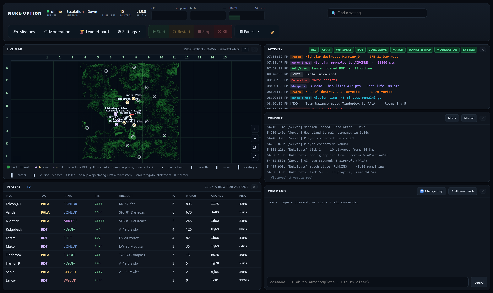
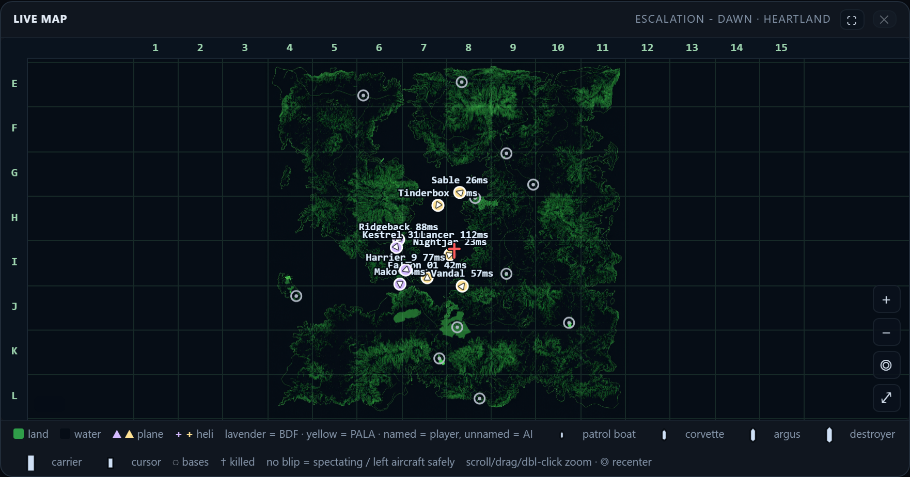
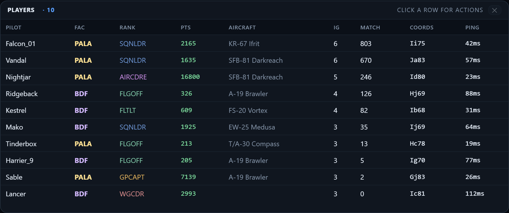
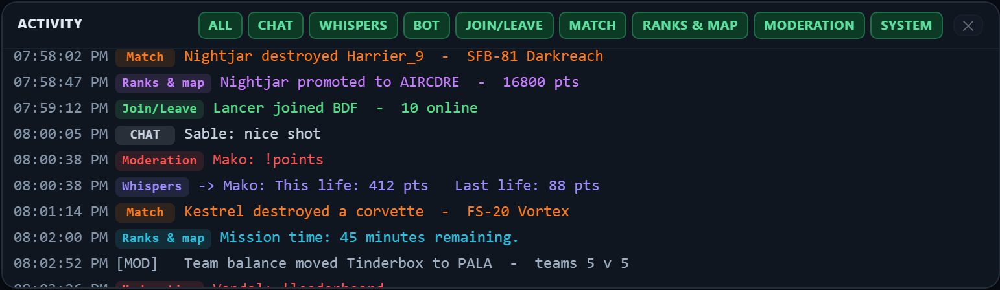
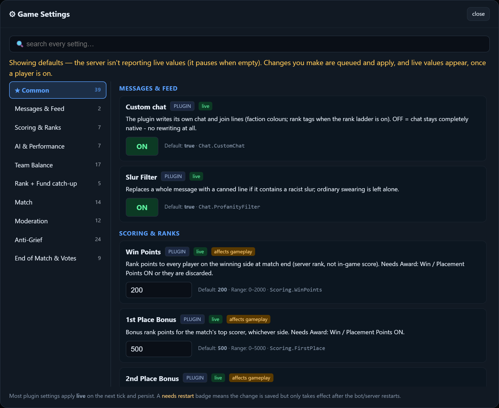

# Nuclear Option Toolkit

A server toolkit for Nuclear Option. It adds ranks, points, map voting and moderation to a dedicated
server, and gives you a web dashboard to run it all from. It's built for servers rented from a host
and managed through a Pterodactyl panel.

Three parts: a BepInEx plugin that runs on the game server, a Python bot, and the web command
centre. The bot and the dashboard run on your own PC, not the game server.

I run two servers on this. This is the public version of it.



## Features

- **Map voting**: a vote opens when a mission ends, or when a player types `!votemap`. The server
  loads whichever map won.
- **Ranks and points**: points come from real in-game score and persist between matches. The rank
  ladder ships empty, so you write your own in the dashboard. Until you do, ranks stay off and the
  points and leaderboard still work.
- **Team-kill enforcement**: eject, then kick, then ban, counted per match. Blast damage is traced
  back to whoever launched, so a nuke doesn't get blamed on the wrong person.
- **Exploit protection**: drops commands aimed at units that are already destroyed. Left alone that
  exploit overflows every client's send buffer and drops the whole lobby. Kicks after 3 strikes in
  10 seconds.
- **Team balancing**: evens out the PvP sides. Being moved doesn't count as a death or cost points.
- **Chat messages**: welcome and join lines, messages on a timer, and a `!help` list you write.
- **Scheduled restarts and plugin updates**, with players warned first.
- **Mission pool**: turn missions on and off for the vote, add one from Steam Workshop, or upload
  your own.
- **Shared ranks**: one points table across two or more of your own servers.

## Installation

You need Python 3.8 or newer on the PC that runs the bot, your panel's SFTP details, and a spare
panel allocation for the relay port. A client API key is optional and only needed for the
dashboard's power buttons.

1. Install Python 3.8 or newer. On Windows tick **Add Python to PATH**.
2. Download the Pterodactyl bundle from the
   [releases page](https://github.com/Tomosnuclearbombos/nuclear-option-toolkit/releases) and unzip
   it anywhere.
3. Run `install.bat` on Windows, or `./install.sh` on macOS and Linux. A setup wizard opens in your
   browser.
4. **Welcome step**: press *Install Python packages*, or skip it if you already have `paramiko`,
   `flask` and `requests`.
5. **Server step**: server name, your admin SteamID64, and the ports. Game port `7777`, query port
   `7778`. They have to be different.
6. **Connection step**: SFTP host, port (usually `2022`, not 22), username (your panel shows it as
   `youraccount.SERVERID`), and your panel password. Press *Test SFTP*.
7. Still on Connection: the relay port, default `5550`, which needs that spare allocation. For the
   power buttons also add the panel URL, a **client** API key starting `ptlc_` from Account > API
   Credentials, and the server id. Press *Test panel*.
8. Press *Install to my server*. It uploads about 25 MB: BepInEx, the plugin, the relay, the server
   config, and a launch wrapper that makes the server boot modded. Then press *Launch This Server*.
9. The panel console should print a long line starting `NukeStats`, with a version number and the
   word `loaded`.

The dashboard is at http://localhost:8770.

To start everything again later, run `START HERE\START THIS SERVER.bat`. The bot restarts itself
after most errors. `run_keepalive.bat` covers it being killed outright.

Two other commands worth knowing:
- `run.bat --set-votekick on|off` turns the game's own vote-kick on or off
- `run.bat --setup-server` rebuilds the launch wrapper after you change the tick rate

The wizard runs locally, on a random port behind a one-time token. Your SFTP password and API key go
in `secrets.json` only, never `config.json`. No IP address is uploaded anywhere.

## The dashboard

http://localhost:8770. Server status, CPU and memory graphs, power buttons and a settings search
across the top. Panels below that, each one can be hidden, and it remembers your layout.

**Live map**
Every player and AI unit as they fly. Named blips are players, unnamed ones are AI. Lavender and
yellow are the two factions. Scroll to zoom, drag to pan.



**Players**
Who's on, what they're flying, their points, rank and ping. Click a row to kick, ban, swap them to
the other team, or send them a message.



**Activity and console**
Chat, joins, kills, votes, rank-ups and admin actions in one list, with buttons to filter it. The
game server's own console output sits below it, and a command box below that.



Six editors live under the Settings menu: Server Config, Game Settings, Schedule, Messages, Ranks
and Updates. Missions, Moderation and Leaderboard have their own buttons.

## Chat commands

- `!help`: the list of server commands
- `!rank`: your rank, points, and progress to the next one
- `!points`: your lifetime points total
- `!stats`: rank, points, win/loss, time played, leaderboard position
- `!leaderboard`: top 5 by points, plus your own position
- `!why`: your recent points events and why each was awarded
- `!prestige` / `!yes`: explains prestige, and confirms one
- `!notk`: the no-team-killing policy and what happens if you break it
- `!autobalance` / `!ab`: how PvP team balancing works
- `!votemap`: calls a mid-mission map change
- `!y` / `!n`: vote on a `!votemap` approval poll
- `!1` to `!6`: vote for that map on an open ballot
- `!spec`: move yourself to spectator
- `!swapteam`: swap sides, but only if the other side has fewer players
- `!forfeit` / `!f`: surrender the PvP match, needs a majority

Admin only: `!balance`, `!forceteamswap <player>`, `!setrank <player> <n>`,
`!setfunds <player> <amount>` and `!addfunds <player> <amount>`. Admins are the SteamIDs listed in
`Admin.SteamIds`, which starts empty.

## Settings

All 92 of them are in the dashboard under Settings > Game Settings. Searchable, each with a
description in plain English and the value it ships with. Most take effect on the next tick.



The same list is written out in [docs/SETTINGS.md](docs/SETTINGS.md).

## Moderation

Team-kills are counted per player, per match. The count resets each match, the bans don't.

1. Ejected from their aircraft, with a warning
2. Kicked, and their in-game rank reset to 0
3. Banned

A kill goes to whoever did the most damage. Anything under 1 damage gets logged as a crash with no
killer, because a missile lock on its own credits 0.001 damage and that was enough to blame the
wrong pilot. Real kills are around 100 for guns and over 1000 for warheads.

The log names the weapon where it can work it out, and the unit where it can't. Kills by a dropped
SAM or another auto-firing defence get logged, but don't count against whoever placed it.

Bans, reports and the game's own vote-kick are in the Moderation window.

## Updating

Nothing updates itself. Pull updates from Settings > Updates in the dashboard, or from the command
line:

```sh
python installer/updater.py check              # what's available, changes nothing
python installer/updater.py update             # installs bot, dashboard, installer; stages the plugin
python installer/updater.py update --deploy    # also deploys the plugin, which restarts the match
```

`--stage-only` downloads and checks without installing. `--component bot` does one part on its own.
Replaced files are backed up as `*.bak-<version>`, and the bot and dashboard need a restart to pick
up new ones.

Every download is checked against the SHA-256 published on the release and against a minisign
signature. If the signature can't be checked the updater stops, unless you pass
`--i-understand-unsigned`. Pre-releases are skipped unless you use `--channel nightly`.

## Security

The dashboard has no login. Anyone who can reach the port can start and stop the server, ban
players, edit settings and hand out points.

It binds to `127.0.0.1`, so only the PC running it can reach it. Leave it there. A home LAN behind a
router is fine too. Don't put it on a public IP.

If you do need it wider, set `web.host` to `0.0.0.0` in `config.json` (or the `NOCC_HOST`
environment variable), and set `web.auth_token` (or `NOCC_AUTH_TOKEN`) at the same time. Changes
then have to carry that token in an `X-NOCC-Token` header.

`run.bat` and `secrets.json` hold your SFTP password. Both are gitignored. Don't commit them.

## How it works

The plugin runs on the game server. It's the only part that can see the match, and it writes out
what happens.

The bot runs on your PC. It reads what the plugin wrote, keeps the points, ranks and match records,
runs the votes, and sends commands back to the server.

The dashboard also runs on your PC. It reads the snapshot the bot writes twice a second and shows
it.

The power buttons skip the bot and go straight to the Pterodactyl API, so they still work when the
bot is down. Everything else goes through the bot, so if the bot stops, the dashboard says the state
is unknown instead of guessing.

## Discord

[dsc.gg/tomosnukes](https://dsc.gg/tomosnukes). Ask there if you get stuck setting it up, or come
and play on the servers I run it on.

## A note on AI

AI was used to help write parts of the code and the docs here. The design and the decisions are
mine. The whole thing came out of running two of my own servers, which is what it was built for.

## Licence

GPL-3.0, see [LICENSE](LICENSE). Bug reports and pull requests welcome.
